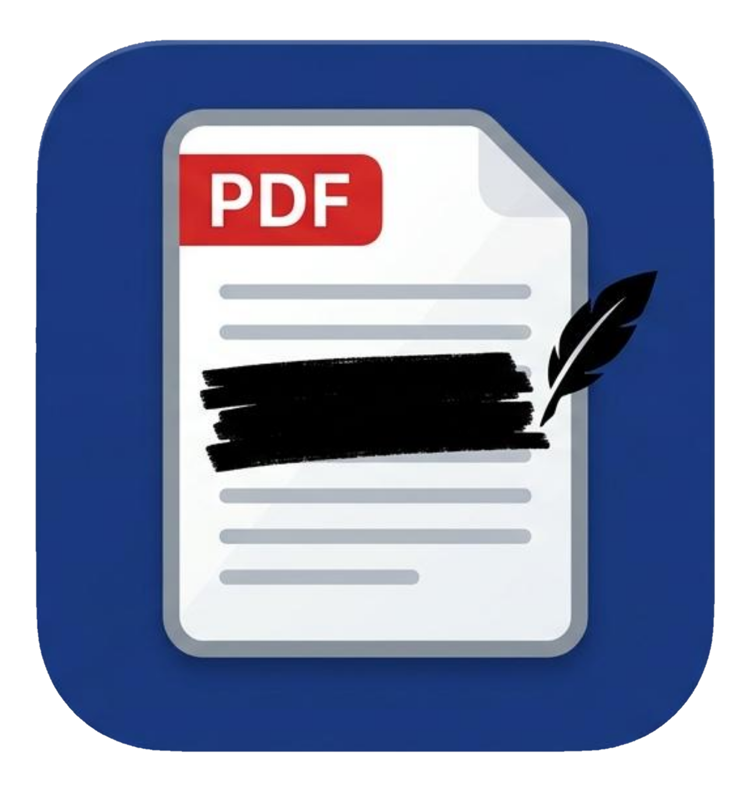

#  RedactPDF

**If the redaction did not work, you do not get a file.** Every export is
re-audited against the rules that produced it. When targeted content survives
in the output, the export is **blocked** and you get a structured report —
what survived, on which page, and why the engine could not remove it.

**Every way of targeting content removes it, instead of covering it.** Text
selection, hand-drawn rectangle, whole page, typed pattern, validated preset:
all of them delete the content from the PDF rather than painting over it.
Images included — the default mode blackens the targeted pixels inside the
bitmap itself, which is what makes a flattened scan redactable without losing
the whole page.

Underneath, the matching is careful about the things that go wrong quietly:
sub-word matches redacted glyph by glyph, accent-insensitive search that keeps
string offsets valid, multi-line matches that refuse to fuse across columns,
phone numbers validated with libphonenumber and card numbers with Luhn.
Metadata, annotations, form fields and embedded attachments are stripped by
default.

Runs entirely on your machine: no upload, no network call, no telemetry.
AGPL-3.0 throughout — no open core, no proprietary module.

For the security model and its limits, see [docs/SECURITY.md](docs/SECURITY.md).

<p align="center">
  <video src="https://github.com/user-attachments/assets/8b4716d7-e6f8-445f-8d00-09b00af840f0" controls width="820">
    <a href="https://github.com/user-attachments/assets/8b4716d7-e6f8-445f-8d00-09b00af840f0">▶ Watch the demo</a>
  </video>
</p>

---

## Download

The quickest way to use RedactPDF: take the file for your system from the
[latest release](https://github.com/theodubus/RedactPDF/releases/latest) and run
it. No Python, no Node, nothing to install — the app opens in your browser and
stops when you close the tab.

| System | File |
| --- | --- |
| Windows | `redactpdf-windows-x86_64.exe` |
| Linux (x86-64) | `redactpdf-linux-x86_64`, `chmod +x` it first |

**Windows shows "Windows protected your PC" on first run**, because the
executable is not signed with a paid code-signing certificate. Click **More
info**, then **Run anyway** — see
[docs/WINDOWS_BUILD.md](docs/WINDOWS_BUILD.md) for why. On Linux the binary
needs a glibc at least as recent as Ubuntu 22.04's.

Since the binary is unsigned, the release page gives you two ways to check it
yourself instead. `SHA256SUMS.txt` says the bytes are the ones that were built:

```bash
sha256sum --ignore-missing -c SHA256SUMS.txt
```

And the build attestation says *this repository* built them, at a known commit,
on GitHub's runners — which a hash alone cannot tell you:

```bash
gh attestation verify redactpdf-linux-x86_64 --repo theodubus/RedactPDF
```

### With Python installed — any OS, and the recommended path on macOS

```bash
pipx install redactpdf
redactpdf
```

Same app, same single command to run it. There is no macOS binary: a file
downloaded through a browser carries a quarantine attribute, and since macOS
Sequoia clearing it takes a trip through System Settings and an admin password.
`pipx` sidesteps that entirely — nothing is downloaded by the browser, so
Gatekeeper never applies. It also makes the install independent of the build
machine's glibc, which is what constrains the Linux binary above.

Everything below is for running RedactPDF from source, or working on it.

---

## Requirements

- **Python 3.10 or newer** (CI runs 3.11)
- **Node.js 20 or newer** (for the frontend dev server / build)
- Linux, macOS, or Windows. The commands below assume a POSIX shell; on
  Windows, activate the venv with `.\.venv\Scripts\Activate.ps1` and use
  backslashes in paths. The test suite and the desktop launcher are exercised
  on Linux and on Windows.

---

## Install

Clone the repo and set up the two halves:

```bash
git clone https://github.com/theodubus/RedactPDF.git
cd RedactPDF
```

### Backend (FastAPI + PyMuPDF)

```bash
cd backend
python -m venv .venv
source .venv/bin/activate
pip install -e ".[dev]"
```

`.[dev]` pulls runtime deps (FastAPI, PyMuPDF, `phonenumbers`, …) plus dev
tooling (pytest, ruff, reportlab, httpx, pypdf).

### Frontend (React + Vite)

```bash
cd ../frontend
npm ci
```

---

## Run locally

Two ways: one command to just use the app, two terminals to work on it.

### Just use it

Build the UI once:

```bash
cd frontend
npm run build
```

Then, from the repo root, with the backend venv active:

```bash
python launch.py
```

This picks a free local port, serves the UI and the API from a single process
(same-origin, so no CORS and no proxy), opens your default browser, and stops
the server a few seconds after you close the tab. Re-run `python launch.py`
whenever you want it again; you only need to rebuild the frontend after
changing the UI source.

### Standalone executable

Prebuilt binaries are attached to every release (see [Download](#download)).
To build your own single file, one that runs without a Python environment:

```bash
pip install -e "backend[dev,packaging]"
python scripts/build_app.py
```

This builds the frontend, then freezes it together with the launcher and the
backend into `dist/redactpdf` (`dist\redactpdf.exe` on Windows). PyInstaller
does not cross-compile, so build on the OS you are targeting.
`python scripts/smoke_test_app.py` drives the result end-to-end to check it.

**On Windows the first launch shows "Windows protected your PC"**: the
executable is not signed with a paid code-signing certificate, so SmartScreen
warns about it. Click **More info → Run anyway**. Every user sees this, on
every version — the reasons and the alternatives are in
[docs/WINDOWS_BUILD.md](docs/WINDOWS_BUILD.md).

### Work on it

Hot reload needs two terminals.

**Terminal 1 - backend:**

```bash
cd backend
source .venv/bin/activate
uvicorn redactpdf.main:app --host 127.0.0.1 --port 8000 --reload
```

**Terminal 2 - frontend:**

```bash
cd frontend
npm run dev
```

Open the URL Vite prints (default: `http://localhost:5173`). The Vite dev
server proxies `/api/*` to the backend on `127.0.0.1:8000` (configured in
[frontend/vite.config.ts](frontend/vite.config.ts)), so you do not need to
worry about CORS in development.

---

## Use it

1. Drop a PDF into the upload area.
2. Add redaction rules in the right pane:
   - **Selection** : select text in the viewer and click "Redact selection" / "Censurer la sélection".
   - **Manual rectangle** : toggle the draw tool and trace rectangles.
   - **Whole page** : censor the current page.
   - **Exact / regex** : typed rules, each with its own options —
     case sensitivity, **Subword**, **Respect accents**, **Multiline**.
   - **Presets** : email, phone (libphonenumber-validated, default region
     `FR`), credit card (Luhn-filtered).
3. Pick an **image redaction mode** in the right pane (segmented control):
   - **Aucune** (None) : images and vector graphics are not modified, even
     if a redaction rectangle overlaps them. Only the text under the
     redaction is removed; visually a black overlay is drawn on top, but
     the underlying images/graphics still exist in the PDF and are
     recoverable by anyone who removes the overlay.
   - **Totale** (Full) : any image touched by a rectangle is removed
     entirely; any vector path touched is removed.
   - **Précise** (Precise) *(default)* : only the pixels inside the
     redaction rectangle are blackened in the underlying bitmap; the rest
     of the image stays visible. Vector paths touched by the rectangle are
     removed (per-path, not pixel-level, vector partial redaction is not
     supported). **This is the mode that makes flattened / scanned PDFs
     redactable**, without it, the only options on a scan would be "lose
     the whole page" or draw a fake black overlay. Re-encoding may be
     lossy on JPEG-backed images.

   The mode applies globally to the redaction request. **Exception**: any
   "Censurer la page" rule (full-page redaction) always uses strict mode
   for the page it covers, regardless of the chosen image mode, so a
   full-page rule cannot accidentally leave images or graphics under a
   black overlay. See [docs/SECURITY.md](docs/SECURITY.md) for details.
4. Click the submit button. The redacted PDF downloads automatically.
5. If the post-redaction audit still finds targeted content in the output,
   you get a report instead of a file, saying what survived and on which
   page. Usually the rule needs fixing; when the report also carries
   `spans_line_break`, the rule is fine and the engine could not target the
   match — see [What it will not do](#what-it-will-not-do).

### What the matching does that you cannot see

The rules are not a literal string comparison, and the differences are exactly
the ones that decide whether something gets missed:

- **Sub-word.** Off in the UI by default, so a rule for `CAT` leaves `CATCH`
  alone. Turn **Subword** on and `CATCH` becomes `CH`: the match is redacted
  glyph by glyph, not word by word.
- **Accents.** Insensitive in the UI by default, so `Leo` also removes `Léo`;
  **Respect accents** turns that off. The folding is length-preserving, which is
  what keeps the offsets that map a match back to glyphs on the page valid.
- **Several lines.** Always on for exact search and for the phone preset; a
  toggle, off by default, for regex rules. A match may run across consecutive
  lines, but only where they overlap horizontally — two columns are never fused.
  That refusal cuts both ways; see the first limit below.
- **Rotated text.** Glyphs are ordered along the line's reading direction rather
  than left to right. On a quarter-turned line the two disagree, and sorting by
  x selects the wrong glyphs for a partial match.
- **Presets are validated, not merely matched.** A card candidate must pass the
  Luhn checksum, a phone candidate must be accepted by libphonenumber for the
  default region — a long digit string that fails the checksum stays. For phones
  the viewer runs that same validation before highlighting, so a highlighted
  number is one the backend will actually remove.
- **The document is stripped as well as redacted.** Metadata (Info dictionary
  and XMP), annotations, form fields and embedded attachments go by default, and
  the file is written with `garbage=4` so removed objects are physically absent
  rather than merely unreferenced.
- **Every rectangle is computed from the original file**, before anything is
  removed. Deriving them from a partly redacted document would let an early rule
  hide the text a later one needed to match.
- **Typed patterns run under a time budget** — 10 seconds per request,
  `REDACT_REGEX_TIMEOUT`. A pattern that backtracks catastrophically returns an
  error naming it instead of freezing the app.

The defaults above are the ones the UI sends. Calling the API directly is not
the same thing: it applies its own defaults, which are documented in
[docs/SECURITY.md](docs/SECURITY.md) and are not identical rule by rule.

### What it will not do

These are the known limits. They are here rather than buried because the
guarantee at the top of this page is only worth what its edges are worth.

- **A match split across a boundary the engine refuses to cross blocks the
  export.** Two columns of prose, or two cells of a `Nom | Prénom` table, sit
  side by side in the flattened text the audit reads, but the engine will not
  fuse them — that refusal is what stops it from redacting unrelated text that
  merely looks contiguous. So a rule for `Dupont Jean` on such a table finds
  nothing to remove, the audit finds the string anyway, and you get a 400. The
  report marks those matches `spans_line_break` and the UI names the way out:
  draw a rectangle over each half.
- **Preset coverage is not audited the way search and regex are.** The audit of
  a typed rule re-reads the output's flat text, independently of the matching
  engine, so it catches both a rectangle that failed to apply and a match the
  engine never found. The preset audit re-runs the *same detector* on the
  output: it catches the first and structurally cannot catch the second. If the
  detector did not recognise something as a phone number going in, it will not
  recognise it going out. With the default region `FR`, a US number written
  without its country code — `212 736 5000` — is neither redacted nor reported,
  and the export succeeds. The preset guarantee is *no phone number this
  detector recognises survives*, not *no phone number survives*.
- **Text inside an image is invisible to text rules.** Search, regex and presets
  read extracted text; a scan has none. Cover it with a rectangle or a full-page
  rule, in **Précise** or **Totale** mode so the bitmap itself loses the pixels.
- **Vector paths are redacted whole.** A rectangle clipping part of a path
  removes the entire path, not the intersected portion.

### Check the output yourself

Nothing here asks you to take the audit's word for it. All three commands come
from `poppler-utils`, which is not this project.

```bash
# Is the text really gone, according to a different library?
pdftotext redacted.pdf - | grep -i "the term you redacted"

# Did the image really change, or is there just a black rectangle on top?
pdfimages -png redacted.pdf /tmp/out && ls /tmp/out*

# Metadata, which is stripped by default
pdfinfo redacted.pdf
```

The first one is the important one: `pdftotext` is poppler, while the redaction
was done by PyMuPDF. If a different implementation cannot find the text either,
that is worth more than an assurance from the tool that removed it. The test
suite does the same thing for the same reason — it reads results back with
`pypdf`, deliberately not the library that wrote them.

### Phone preset region

The `phone` preset uses `phonenumbers` to validate candidates. Numbers
without a leading `+` are parsed against a default region. To change it:

```bash
export REDACT_DEFAULT_REGION=US
uvicorn redactpdf.main:app ...
```

---

## Run the tests

```bash
cd backend
source .venv/bin/activate
ruff check .
pytest
```

The test suite uses **versioned PDF fixtures** : see
[backend/tests/fixtures/README.md](backend/tests/fixtures/README.md). Do not
edit the generated PDFs by hand. If you change the fixture generator,
regenerate all of them in one go:

```bash
python -m backend.tests.fixtures.generate_fixtures
```

---

## Production deployment

This project is built for local single-user usage. **Exposing the API to
untrusted networks or multiple users is unsafe out of the box**: there is no
auth, no rate limiting and no upload size cap. Regex execution *is* bounded —
that one is in the application, because the main way to run RedactPDF is a
local binary with no reverse proxy in front of it. If you plan to host it for
others, read
[docs/SECURITY.md → Production / Multi-user Deployment](docs/SECURITY.md)
first and put the recommended protections in your reverse proxy /
container.

A typical setup is: build the frontend (`npm run build` produces a static
bundle in `frontend/dist`), serve it from a reverse proxy that also
proxies `/api/*` to the backend (Uvicorn or Gunicorn-with-Uvicorn-workers
behind nginx/Caddy). With same-origin serving, you do not need CORS.

---

## License

RedactPDF is licensed under the **GNU Affero General Public License v3.0**
(AGPL-3.0) — see [LICENSE.md](LICENSE.md) for the full text.

In short: you may use, study, modify, and redistribute it freely, but any
redistributed or network-hosted (SaaS) version, including modified ones,
must make its **complete corresponding source available under the same
AGPL-3.0 terms**. This copyleft is also required by the core dependency
PyMuPDF, which is itself AGPL-3.0 (or commercial).

<div align="right" style="display: flex">
    
    <a href="https://github.com/theodubus" alt="https://github.com/theodubus"></a>
    <a href="LICENSE.md" alt="licence"></a>
</div>
